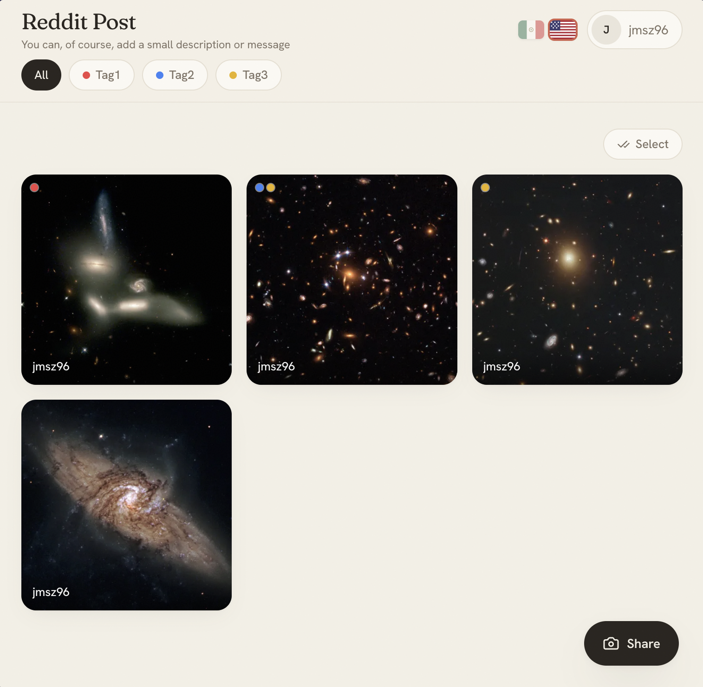

# Linse

Self-hosted photo sharing for events. Guests scan a QR code, pick a display name (no account, no password needed), and start uploading and browsing photos right away. The host defines tags, moderates uploads, and controls the look — all from a simple admin panel.

- **Guests** — upload, browse, filter by tag, like, comment. New photos appear live, no refresh needed.
- **Host** — create events, define tags, print the QR code, hide or delete photos, manage guests, export originals to a host folder.
- **Your data** — one Docker Compose stack (app + Postgres), everything stored in your own volumes.

---

# Screenshots



## Install with Docker Compose

The only requirement is Docker with the Compose plugin.

### Option A — No clone, just run it

Grab the compose file into a fresh directory:

```bash
mkdir linse && cd linse
curl -fsSL https://raw.githubusercontent.com/jmsz1996/linse-app/main/compose.yml -o compose.yml
```

Create a `.env` file next to it. Generate each secret with `openssl rand -base64 32`:

```bash
cat > .env <<'EOF'
POSTGRES_PASSWORD=replace-with-a-long-random-string
AUTH_SECRET=replace-with-openssl-rand-base64-32
LINSE_SECRET=replace-with-another-openssl-rand-base64-32
HOST_ADMIN_EMAIL=you@example.com
HOST_ADMIN_PASSWORD=replace-with-a-strong-password
LINSE_PORT=3000
EOF
```

Start it up:

```bash
docker compose up -d
```

Open `http://localhost:3000` (or whatever `LINSE_PORT` you set). Sign in at `/admin` with your admin email and password. That's it — migrations and the host account are set up automatically on first boot.

> This pulls the image from `ghcr.io/jmsz1996/linse-app`. If it's not available yet, use Option B below.

### Option B — Build from source

```bash
git clone https://github.com/jmsz1996/linse-app.git
cd linse-app
cp .env.example .env   # fill in the secrets
docker compose -f compose.yml -f compose.build.yml up -d --build
```

Same result, just builds the image locally instead of pulling it.

---

## Configuration

All config is via environment variables. The ones marked **required** need to be set — everything else has a sensible default.

| Variable | Required | Default | Purpose |
|---|---|---|---|
| `POSTGRES_PASSWORD` | yes | — | Postgres password |
| `AUTH_SECRET` | yes | — | Host login session secret (≥ 32 chars) |
| `LINSE_SECRET` | yes | — | Guest session secret (≥ 32 chars) |
| `HOST_ADMIN_EMAIL` | yes | — | Admin login email |
| `HOST_ADMIN_PASSWORD` | yes | — | Admin login password (set/updated on every boot) |
| `LINSE_PORT` | no | `3000` | Port exposed on the host |
| `LINSE_VERSION` | no | `latest` | Image tag to pull (e.g. `v0.1.0`) |
| `UPLOAD_DIR` | no | `/data/uploads` | In-container path for uploaded photos |
| `EXPORT_DIR` | no | `./exports` | Host folder the "Export originals" action writes to |

Persistent data lives in two named Docker volumes: `linse_pgdata` (database) and `linse_uploads` (photos). Exported originals are written to the host folder set by `EXPORT_DIR` (default `./exports`) — a bind mount, not a Docker volume.

> ⚠️ `docker compose down -v` deletes both volumes — meaning all your data. (Your `EXPORT_DIR` folder is a host bind mount and is left untouched.) Use plain `docker compose down` to just stop the containers.

---

## HTTPS / reverse proxy

To put linse behind a reverse proxy (Caddy, nginx, Traefik…), point it at `linse-app:3000`. There's a ready-made Caddy overlay:

```bash
docker compose -f compose.yml -f compose.caddy.yml up -d
# Caddyfile:  linse.example.com { reverse_proxy linse-app:3000 }
```

---

## Operations

Backups, restore, upgrades, password rotation, and troubleshooting tips are all in the **[runbook](./runbook.md)**.

---

## Development

The dev stack bind-mounts the source and runs Next.js in hot-reload mode on port **3010**. Only Docker needed.

```bash
cp .env.example .env
docker compose -f compose.yml -f compose.dev.yml up -d --build

# First boot — run migrations and seed the host user:
docker compose -f compose.yml -f compose.dev.yml exec app pnpm prisma migrate deploy
docker compose -f compose.yml -f compose.dev.yml exec app pnpm prisma db seed

# Browse http://localhost:3010

# Type-check and lint:
docker compose -f compose.yml -f compose.dev.yml exec app pnpm typecheck
docker compose -f compose.yml -f compose.dev.yml exec app pnpm lint
```

Releases are published by pushing a `v*` git tag — CI builds a multi-arch image (amd64 + arm64) and pushes it to GHCR. See the [runbook](./runbook.md#cut-a-release-publish-the-image) for the full flow.

---

## Stack

Next.js 16 (App Router) + TypeScript, PostgreSQL via Prisma, Tailwind v4 + shadcn/ui, NextAuth for host login, `sharp` for the image pipeline.

Guest sessions are HttpOnly signed cookies — only the token hash is stored in the DB. Photos are EXIF-stripped on upload and served through route handlers (never exposed directly). Per-event isolation is enforced in every query; guest mutations are CSRF-checked and rate-limited.

---

## License

[AGPL-3.0](./LICENSE). If you run a modified linse as a network service, you must make your source available to its users.

<a href="https://buymeacoffee.com/jmsz1996">
  
</a>

